## Visual Journey

Setting up my tools and equipment for coding was relativley easy, and I feel confident in my ability to do so again should the need arise.

I have essentally managed to create my own Github repository, clone the repository, open it in VSCode, edit it, and then push the edits to Github to update my siter as I would want.

We primarily use  Ubuntu and Linux

Amazing mermaid chart made with help of Claude

```mermaid
  flowchart TD
    Start([Start]) --> CreateAccount{Have GitHub<br/>Account?}
    CreateAccount -->|No| SignUp[Sign up at github.com]
    CreateAccount -->|Yes| CreateRepo[Create New Repository]
    SignUp --> CreateRepo
    
    CreateRepo --> RepoName[Enter repository name<br/>e.g., username.github.io]
    RepoName --> RepoSettings[Set repo to Public<br/>Initialize with README]
    RepoSettings --> CreateButton[Click 'Create Repository']
    
    CreateButton --> EnablePages[Go to Settings > Pages]
    EnablePages --> SelectSource[Select Source: main branch]
    SelectSource --> SavePages[Save GitHub Pages settings]
    SavePages --> PagesEnabled[GitHub Pages is now live!]
    
    PagesEnabled --> InstallGit{Git installed<br/>on computer?}
    InstallGit -->|No| DownloadGit[Download Git from git-scm.com]
    InstallGit -->|Yes| CopyURL
    DownloadGit --> CopyURL[Copy repository URL<br/>from GitHub]
    
    CopyURL --> OpenTerminal[Open Terminal/Command Prompt]
    OpenTerminal --> Navigate[Navigate to desired folder<br/>cd /path/to/folder]
    Navigate --> Clone[Run: git clone URL]
    Clone --> CloneComplete[Repository cloned locally]
    
    CloneComplete --> InstallVSCode{VS Code<br/>installed?}
    InstallVSCode -->|No| DownloadVSCode[Download VS Code from<br/>code.visualstudio.com]
    InstallVSCode -->|Yes| OpenVSCode
    DownloadVSCode --> OpenVSCode[Open VS Code]
    
    OpenVSCode --> OpenFolder[File > Open Folder]
    OpenFolder --> SelectCloned[Select cloned repository folder]
    SelectCloned --> VSCodeReady[VS Code ready to edit!]
    
    VSCodeReady --> MakeChanges[Make changes to files]
    MakeChanges --> GitCommit[Stage & Commit changes<br/>git add .<br/>git commit -m 'message']
    GitCommit --> GitPush[Push to GitHub<br/>git push origin main]
    GitPush --> PagesUpdate[GitHub Pages updates<br/>automatically]
    PagesUpdate --> End([Complete!])
    
    style Start fill:#90EE90
    style End fill:#90EE90
    style PagesEnabled fill:#87CEEB
    style CloneComplete fill:#87CEEB
    style VSCodeReady fill:#87CEEB
    style PagesUpdate fill:#FFD700make
```

